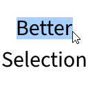

# Better Selection

This is a Fabric mod for Minecraft that makes text more pleasant to select. It improves the "move by word" feature (<kbd>Ctrl</kbd>+<kbd>←</kbd> and <kbd>Ctrl</kbd>+<kbd>→</kbd>), fixes [MC-260563](https://bugs.mojang.com/browse/MC-260563), and makes text selection with the mouse more precise.

## Q&A

### Does it support non-left-to-right scripts?

Yes, it does.

### Does it add keyboard shortcuts?

No. This mod only improves Vanilla features.

### Does it fix [MC-121278](https://bugs.mojang.com/browse/MC-121278)?

No, it does not. But I made another mod that does: [Universal Shortcuts](https://modrinth.com/mod/universal-shortcuts).
